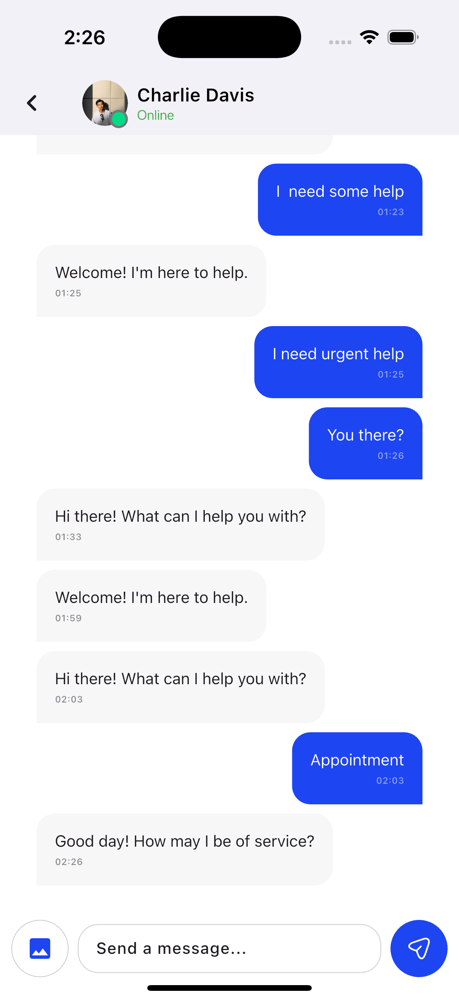
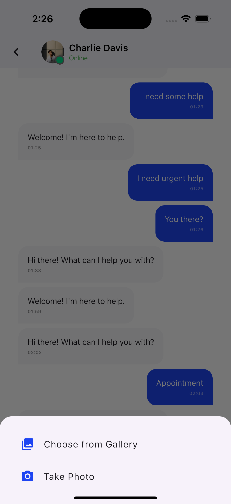
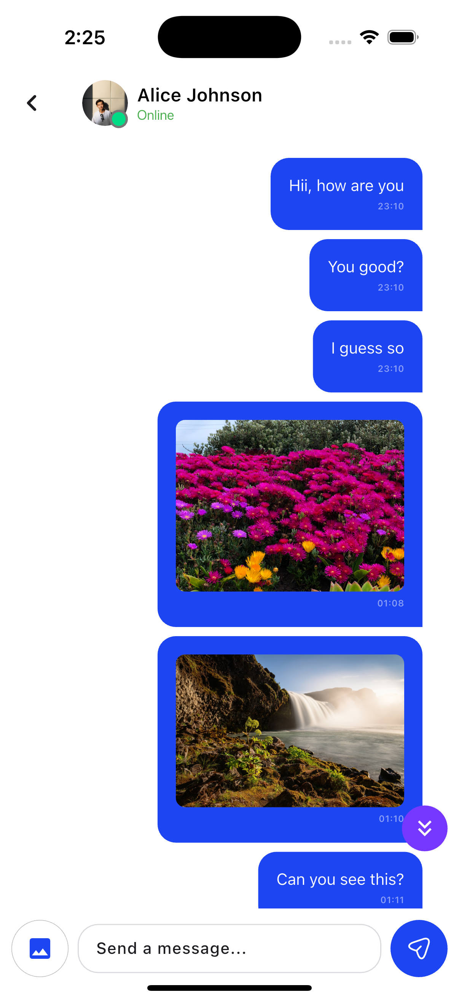
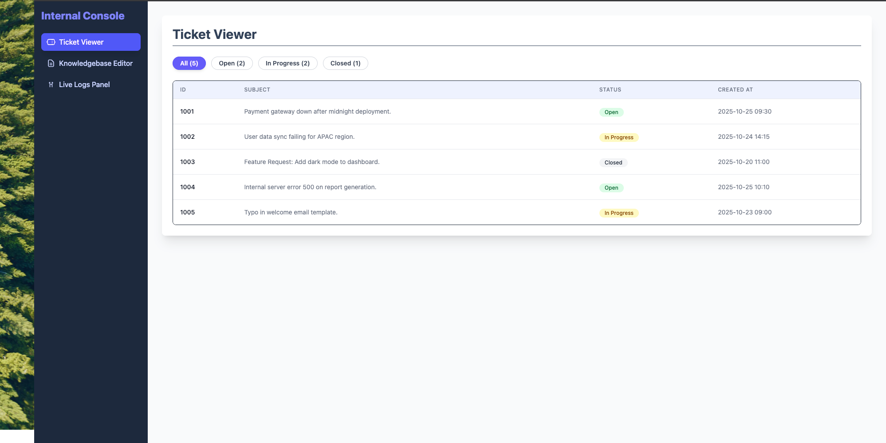
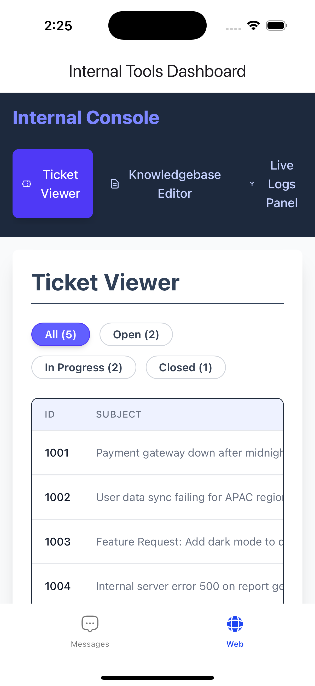
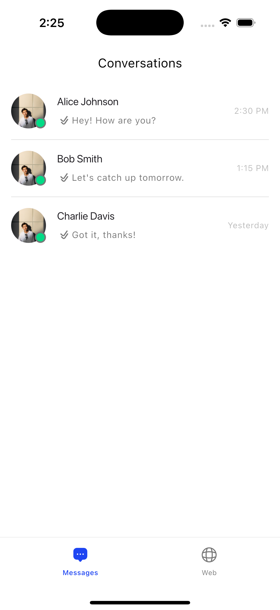

# Full-Stack Cross-Tech Integration Assessment

This repository contains a dual-module application demonstrating full-stack capabilities, cross-platform integration, and reactive UI development.

The project consists of:
1. **`flutter_app/`**: A native mobile messaging interface built with Flutter featuring local storage, image sharing, and intelligent support agent.
2. **`web_app/`**: An Internal Tools Dashboard built with Angular 16+ and Tailwind CSS.

---

## 🚀 Getting Started

### Prerequisites

- **Node.js** (v16+) and npm
- **Flutter SDK** (v3.0+)
- **Angular CLI**: `npm install -g @angular/cli`
- **Android Studio** / **Xcode** (for mobile development)

---

## 1️⃣ Setting up the Angular Dashboard (`web_app`)

The Angular application acts as the "Internal Tools" backend interface. It must be running locally for the Flutter app to display it in the WebView.

### Steps:

1. **Navigate to the Angular project directory:**
```bash
   cd web_app
```

2. **Install Dependencies:**
   
   ⚠️ **Important**: This installs Angular, Tailwind CSS, and PostCSS dependencies locally.
```bash
   npm install
```

3. **Install Missing Tailwind PostCSS Plugin** (if needed):
```bash
   npm install -D @tailwindcss/postcss
```

4. **Start the Local Server:**
   
   We use the `--host 0.0.0.0` flag to ensure the server is accessible to external network requests (specifically from the Android Emulator).
```bash
   ng serve --host 0.0.0.0
```

   - **Access in Browser**: `http://localhost:4200`
   - **Status**: Keep this terminal open and running.

### Troubleshooting Angular:

**Error: Cannot find module '@tailwindcss/postcss'**
```bash
npm install -D @tailwindcss/postcss
```

**Tailwind CSS not rendering:**
- Verify `tailwind.config.js` content paths include `"./src/**/*.{html,ts}"`
- Ensure `src/styles.css` contains:
```css
  @import "tailwindcss";
```
- Restart the dev server after configuration changes

---

## 2️⃣ Setting up the Flutter App (`flutter_app`)

The Flutter application serves as the mobile client, featuring:
- ✅ Native messaging interface with chat bubbles
- ✅ Local storage using SQLite
- ✅ Image sharing (gallery + camera)
- ✅ Intelligent support agent with auto-replies
- ✅ Embedded WebView for Angular dashboard
- ✅ Clean Architecture with BLoC pattern

### Steps:

1. **Navigate to the Flutter directory:**
```bash
   cd flutter_app
```

2. **Install Dependencies:**
```bash
   flutter pub get
```

3. **Run the Application:**
   
   Select your target device (iOS Simulator or Android Emulator) and run:
```bash
   flutter run
```

   Or for specific platforms:
```bash
   flutter run -d chrome          # Web
   flutter run -d macos           # macOS
   flutter run -d <device-id>     # iOS/Android device
```

---

## 📱 WebView & Networking Configuration

The Flutter app includes logic to automatically detect the host platform and adjust the WebView URL to connect to the local Angular server.

| Target Platform | URL Used | Reason |
|----------------|----------|--------|
| **iOS Simulator** | `http://localhost:4200` | The iOS simulator shares the host machine's network stack directly. |
| **Android Emulator** | `http://10.0.2.2:4200` | Android emulators run on a virtual network. `10.0.2.2` is the special alias address for the host machine's loopback interface (`127.0.0.1`). |
| **Physical Device** | `http://[YOUR_PC_IP]:4200` | Requires your computer's actual LAN IP address (e.g., `http://192.168.1.100:4200`). |

### Finding Your PC's IP Address:

**macOS/Linux:**
```bash
ifconfig | grep "inet " | grep -v 127.0.0.1
```

**Windows:**
```bash
ipconfig
# Look for "IPv4 Address" under your active network adapter
```

### ⚠️ Important Notes:

- **Android Emulator**: If the WebView shows a "Connection Refused" error, ensure you ran `ng serve --host 0.0.0.0` in the Angular step.
- **Physical Device**: Both your computer and mobile device must be on the same WiFi network.
- **Firewall**: Ensure port 4200 is not blocked by your firewall.

---

## 🛠 Assumptions & Design Decisions

### Assumptions

1. **Monorepo Structure**: The project is structured as a monorepo. Dependencies for Tailwind and PostCSS are installed locally within the `web_app` directory to ensure the Angular CLI finds them during the build process.

2. **Local Storage Only**: The messaging feature uses SQLite for local persistence. No backend server is required for the chat functionality.

3. **Simulated Features**: 
   - The "Save Draft" feature in the Knowledgebase uses local state
   - "Live Logs" are simulated on the client side using timers
   - Support agent responses are generated client-side with keyword matching

4. **Single User Context**: The messaging app simulates conversations with a support agent. Multi-user authentication is not implemented.

### Technical Stack

#### Flutter App:
- **State Management**: flutter_bloc + BLoC pattern
- **Dependency Injection**: get_it
- **Local Storage**: sqflite
- **Error Handling**: dartz (Either type)
- **Architecture**: Clean Architecture (Data/Domain/Presentation)

#### Angular Dashboard:
- **Styling**: Tailwind CSS v4
- **State Management**: Angular Signals
- **Build Tool**: Angular CLI with esbuild

---

## ✨ Stretch Goals Completed

### 1. **Reactive State Management**
   - **Angular**: Used Angular Signals (`signal`, `computed`) for high-performance state management (filtering tickets, live log updates).
   - **Flutter**: Used BLoC pattern with flutter_bloc for reactive UI updates and state preservation.

### 2. **Fully Responsive Design**
   - The Angular dashboard utilizes Tailwind's utility classes (`flex-col`, `md:flex-row`, `w-full`, `md:w-64`) to seamlessly adapt between mobile (inside WebView) and desktop views.
   - Flutter UI is responsive with adaptive layouts for different screen sizes.

### 3. **Cross-Platform Styling**
   - The Flutter UI theming was built to visually mirror the Tailwind styling (Slate-800 sidebars, Indigo accents) for a cohesive brand experience.

### 4. **Advanced Flutter Features**
   - ✅ **Image Messaging**: Send photos from gallery or camera
   - ✅ **Smart Support Agent**: Context-aware auto-replies with keyword detection
   - ✅ **Typing Indicators**: Visual feedback during agent response
   - ✅ **Message Management**: Long-press to delete messages
   - ✅ **Clean Architecture**: Separation of concerns with testable code
   - ✅ **Error Handling**: Proper failure handling with Either type

### 5. **Support Agent Intelligence**
   - Keyword-based response system with multiple categories:
     - Greetings (hello, hi, hey)
     - Help requests (help, assist, support)
     - Questions (how, what, when, where, why)
     - Appointments (schedule, booking)
     - Pricing inquiries
     - Location requests
   - Random response variation for natural conversation
   - 1-3 second typing delay simulation
   - Initial greeting on conversation start

---

## 📦 Key Dependencies

### Flutter (`flutter_app/pubspec.yaml`)
```yaml
dependencies:
  # State Management
  flutter_bloc: ^8.1.3
  equatable: ^2.0.5
  
  # Dependency Injection
  get_it: ^7.6.4
  
  # Local Storage
  sqflite: ^2.3.0
  path_provider: ^2.1.2
  
  # Error Handling
  dartz: ^0.10.1
  
  # Image Handling
  image_picker: ^1.0.7
  
  # WebView
  webview_flutter: ^4.4.2
  
  # Utilities
  intl: ^0.18.1
  gap: ^3.0.1
```

### Angular (`web_app/dashboard/package.json`)
```json
{
  "dependencies": {
    "@angular/core": "^19.0.0",
    "@angular/common": "^19.0.0",
    "@angular/router": "^19.0.0"
  },
  "devDependencies": {
    "tailwindcss": "^4.1.17",
    "@tailwindcss/postcss": "^4.0.0",
    "@angular/cli": "^19.0.0"
  }
}
```

---

## 🏗️ Architecture Overview

### Flutter Clean Architecture
```
flutter_app/
├── lib/
|   |
│   ├── app/
│   │   ├── app.dart                  # Main app widget
│   ├── core/
│   │   ├── di/
│   │   │   └── injection_container.dart
│   │   ├── domain/
│   │   │   └── constants.dart
│   │   ├── error/
│   │   │   └── failure.dart
│   │   ├── presentation/
│   │   │   ├── res/             # Resources (colors, fonts, images, vectors)
│   │   │   ├── utilities/       # Utilities (date_util)
│   │   │   └── widgets/         # Reusable widgets
│   │   └── usecase/
│   │       └── usecase.dart
│   ├── features/
│   │   ├── home/presentation/screen/
│   │   │   └── home.dart
│   │   ├── messaging/
│   │   │   ├── data/
│   │   │   │   ├── datasources/
│   │   │   │   │   └── message_local_datasource.dart
│   │   │   │   ├── models/
│   │   │   │   │   └── message_model.dart
│   │   │   │   └── repositories/
│   │   │   │       └── message_repository_impl.dart
│   │   │   ├── domain/
│   │   │   │   ├── entities/
│   │   │   │   │   └── message.dart
│   │   │   │   ├── repository/
│   │   │   │   │   └── message_repository.dart
│   │   │   │   └── usecase/
│   │   │   │       ├── delete_message.dart
│   │   │   │       ├── get_messages.dart
│   │   │   │       └── send_message.dart
│   │   │   └── presentation/
│   │   │       ├── bloc/
│   │   │       │   ├── message_bloc.dart
│   │   │       │   ├── message_event.dart
│   │   │       │   └── message_state.dart
│   │   │       ├── screens/
│   │   │       │   ├── conversations_screen.dart
│   │   │       │   └── messages_screen.dart
│   │   │       └── widgets/
│   │   │           ├── conversation_item.dart
│   │   │           ├── message_bubble.dart
│   │   │           └── typing_indicator.dart
│   │   ├── web/presentation/screen/
│   │   │   └── web_view_screen.dart
│   │   └── widgets/
│   └── services/
│       ├── image_picker_service.dart
│       └── support_agent_service.dart
├── pubspec.yaml                 # Flutter dependencies
web_app/                         # Angular files
```

### Benefits:
- ✅ **Testability**: Each layer can be tested independently
- ✅ **Maintainability**: Clear separation of concerns
- ✅ **Scalability**: Easy to add new features
- ✅ **Flexibility**: Swap implementations without affecting other layers

---

## 🧪 Testing

### Flutter Tests
```bash
# Run all tests
flutter test

# Run with coverage
flutter test --coverage

# Run specific test file
flutter test test/features/messaging/domain/usecases/send_message_test.dart
```

### Angular Tests
```bash
cd web_app

# Run unit tests
ng test

# Run e2e tests
ng e2e
```

---

## 🐛 Troubleshooting

### Common Issues

#### 1. **BLoC Provider Not Found Error**
```
Error: Could not find the correct Provider<MessageBloc>
```
**Solution**: Ensure `BlocProvider` wraps `MaterialApp`:
```dart
BlocProvider(
      create: (context) => sl<MessageBloc>(),
      child: MaterialApp(
        title: 'Turbo Vets Assessment',
        debugShowCheckedModeBanner: false,
        home: const Home(),
      ),
    );
```

#### 2. **Angular Tailwind Not Rendering**
```
Tailwind classes not applying styles
```
**Solution**:
```bash
npm install -D @tailwindcss/postcss
# Then restart: ng serve --host 0.0.0.0
```

#### 3. **WebView Shows "Connection Refused" on Android**
**Solution**: 
- Verify Angular is running with `--host 0.0.0.0`
- Use `http://10.0.2.2:4200` for Android Emulator
- Check firewall settings

#### 4. **Images Not Displaying in Flutter**
**Solution**: 
- Check permissions in `AndroidManifest.xml` and `Info.plist`
- Verify image paths are valid
- Restart app after permission changes

#### 5. **Support Agent Not Responding**
**Solution**:
- Check console logs for errors
- Verify `triggerAutoReply` is `true` in `SendMessageEvent`
- Ensure message sender is not "Support Agent"
- Do a hot restart (not just hot reload)

---

## 📸 Screenshots

### Flutter Chat Interface

*Native messaging interface with chat bubbles and typing indicators*

### Image Sharing



*Send images from gallery or camera with preview*

### Angular Dashboard (Desktop)

*Full-featured internal tools dashboard with responsive layout*

### Angular Dashboard (Mobile WebView)

*Dashboard seamlessly integrated in Flutter WebView*

### Conversations List

*List of conversations with online status indicators*

---

## 🔮 Future Enhancements

### Potential Features:
- [ ] **Backend Integration**: Connect to REST API or Firebase
- [ ] **Push Notifications**: Real-time message alerts
- [ ] **Multi-User Support**: User authentication and profiles
- [ ] **Voice Messages**: Record and send audio
- [ ] **Read Receipts**: Track message delivery and read status
- [ ] **Message Search**: Full-text search across conversations
- [ ] **Chat Groups**: Multi-user group conversations
- [ ] **File Attachments**: Support for PDF, documents
- [ ] **End-to-End Encryption**: Secure messaging
- [ ] **Message Reactions**: Emoji reactions to messages
- [ ] **Cloud Backup**: Sync messages across devices

---

## 📄 License

This project is licensed under the MIT License - see the LICENSE file for details.

---

## 👨‍💻 Developer

**Kingsley Ebuka Ihekwaba**
- Email: kingsleyihekwaba208@gmail.com
- GitHub: [@quabiee07](https://github.com/quabiee07)
- LinkedIn: [Kingsley Ihekwaba](https://linkedin.com/in/kingsley-ihekwaba-9365ab206/)

---

## 🙏 Acknowledgments

- Flutter Team for the amazing framework
- Angular Team for Angular 19 and Signals
- Tailwind CSS for utility-first styling
- Clean Architecture principles by Uncle Bob
- BLoC pattern documentation and community

---

**Built with ❤️ using Flutter & Angular**

*Assessment Completed: December 2025*
